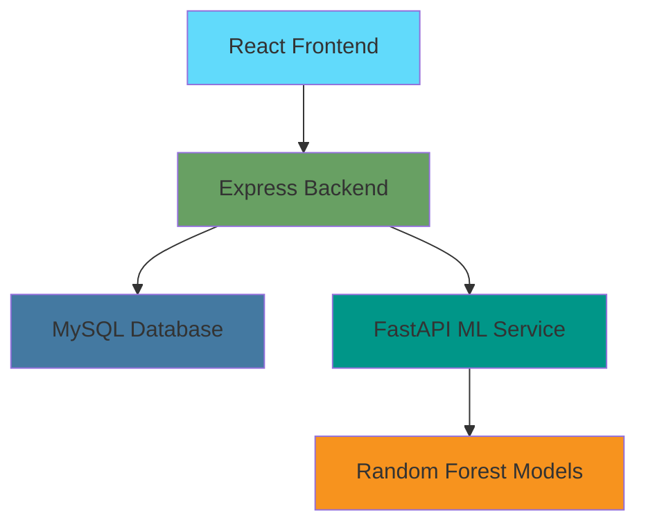

<div align="center">

# 🎓 Digital Twin of a Student

[](https://opensource.org/licenses/MIT)
[](https://nodejs.org/)
[](https://www.python.org/)
[](https://www.mysql.com/)

**A production-ready full-stack application that builds intelligent digital twins of students using daily academic and lifestyle data. Predicts burnout risk, attendance patterns, and exam performance with early alerts and personalized recommendations.**

</div>

---

## � Features

### 🎯 Core Capabilities
- **🔮 Predictive Analytics** - ML-powered predictions for burnout, attendance, and exam performance
- **📊 Real-time Dashboard** - Interactive visualizations and comprehensive data insights
- **⚡ Smart Alerts** - Early warning system with actionable recommendations
- **📱 Responsive Design** - Modern UI built with React and Tailwind CSS
- **🔐 Secure Authentication** - JWT-based auth with encrypted data storage

### 🛠️ Tech Stack

<div align="center">

**Frontend**


**Backend**


**ML & AI**


</div>

---

## 🏗️ Architecture

<div align="center">



</div>

### 📋 System Design

- **Frontend**: React (Vite) + Tailwind CSS + Recharts
- **Backend**: Node.js + Express (REST APIs)
- **ML Service**: Python (FastAPI) for predictions
- **Database**: MySQL with optimized schema
- **Communication**: Frontend → Backend → ML Service

---

## 🚀 Quick Start

### 📋 Prerequisites

- **Node.js** (v18 or higher)
- **Python** (v3.8 or higher)  
- **MySQL** (v8.0 or higher)
- **npm** or **yarn**

---

### 🗄️ 1. Database Setup

1. **Install MySQL** if not already installed
2. **Start MySQL service**:
   - **Windows**: Start MySQL service from Services
   - **Mac/Linux**: `sudo systemctl start mysql` or `brew services start mysql`
3. **Create database**:
```sql
CREATE DATABASE digital_twin;
```
4. **Note your database credentials** (host, port, user, password)

---

### ⚙️ 2. Backend Setup

```bash
cd backend
npm install
```

Create a `.env` file in the `backend` directory:

```env
PORT=5000
NODE_ENV=development

DB_HOST=localhost
DB_PORT=3306
DB_NAME=digital_twin
DB_USER=root
DB_PASSWORD=your_mysql_password

JWT_SECRET=your_super_secret_jwt_key_change_this_in_production
JWT_EXPIRES_IN=7d

ML_SERVICE_URL=http://localhost:8000
```

**Start the backend:**
```bash
npm start
# or for development with auto-reload
npm run dev
```

> 💡 The backend will automatically create all necessary tables on first run.

---

### 🤖 3. ML Service Setup

```bash
cd ml-service
python -m venv venv
source venv/bin/activate  # On Windows: venv\Scripts\activate
pip install -r requirements.txt
```

**Start the ML service:**
```bash
python main.py
# or
uvicorn main:app --reload --port 8000
```

> 🚀 The ML service will train models on startup (takes a few seconds).

---

### 🎨 4. Frontend Setup

```bash
cd frontend
npm install
```

**Start the frontend:**
```bash
npm run dev
```

The frontend will be available at `http://localhost:3000`

---

### 🌱 5. (Optional) Seed Sample Data

To populate the database with sample student data:

```bash
cd backend
node scripts/seed.js
```

**Test Account:**
- Email: `test@example.com`
- Password: `password123`

---

## 📱 Dashboard Features

### 📊 Daily Data Input
- **Sleep hours** tracking
- **Attendance percentage** monitoring
- **Study hours** logging
- **Stress level** assessment (1-10)
- **Upcoming deadlines** counting

### 📈 Prediction Cards
- **Burnout Risk** (Low/Medium/High) with visual gauge
- **Attendance Risk** (% probability) with trend analysis
- **Exam Performance** (predicted score) with confidence intervals

### 🎯 Interactive Visualizations
- **Burnout gauge** - Circular progress indicator
- **Attendance trend** - Line chart with historical data
- **Exam predictions** - Bar chart with score distributions

### 🚨 Smart Alerts System
- **Real-time alerts** based on ML predictions
- **Color-coded severity** levels (Green/Yellow/Red)
- **Actionable recommendations** for each alert type

---

## 🧠 ML Models

### 🎯 Model Architecture

The ML service uses **Random Forest** models for:

1. **Burnout Risk Classification** (Low/Medium/High)
   - **Features**: sleep, stress, deadlines, study hours
   - **Feature Engineering**: sleep deficit, deadline pressure, stress-study ratio

2. **Attendance Risk Regression** (0-100% probability)
   - Based on current attendance patterns and stress factors

3. **Exam Performance Regression** (0-100% score)
   - Considers study hours, attendance, stress, sleep quality

> 📊 Models are trained on synthetic data at startup. In production, replace with real historical data.

---

## � Project Structure

```
DigiTwin/
├── 📂 frontend/              # React + Vite + Tailwind
│   ├── src/
│   │   ├── components/       # Reusable UI components
│   │   ├── pages/           # Page components
│   │   ├── hooks/           # Custom React hooks
│   │   └── utils/           # Utility functions
│   ├── public/              # Static assets
│   └── package.json
├── 📂 backend/               # Node.js + Express
│   ├── src/
│   │   ├── routes/          # API routes
│   │   ├── middleware/      # Express middleware
│   │   ├── models/          # Database models
│   │   └── utils/           # Backend utilities
│   ├── config/              # Database configuration
│   ├── scripts/             # Database scripts
│   └── package.json
├── 📂 ml-service/            # Python + FastAPI
│   ├── models/              # ML model definitions
│   ├── utils/               # ML utilities
│   ├── main.py              # FastAPI application
│   └── requirements.txt
└── 📄 README.md
```

---

## 🔒 Security Features

- **🔐 Password Hashing** - bcrypt encryption for secure storage
- **🎫 JWT Authentication** - Token-based authentication system
- **🛡️ Protected Routes** - Secure API endpoints with middleware
- **✅ Input Validation** - Comprehensive validation on all endpoints
- **🌐 CORS Configuration** - Cross-origin resource sharing security

---

## 📡 API Endpoints

### 🔐 Authentication
| Method | Endpoint | Description |
|--------|----------|-------------|
| `POST` | `/api/auth/register` | Register new user |
| `POST` | `/api/auth/login` | Login user |
| `GET` | `/api/auth/me` | Get current user (protected) |

### 📊 Student Data
| Method | Endpoint | Description |
|--------|----------|-------------|
| `POST` | `/api/student/data` | Submit daily student data (protected) |
| `GET` | `/api/student/history` | Get student data history (protected) |

### 🔮 Predictions
| Method | Endpoint | Description |
|--------|----------|-------------|
| `POST` | `/api/predict` | Get predictions (protected) |

### � Alerts
| Method | Endpoint | Description |
|--------|----------|-------------|
| `GET` | `/api/alerts` | Get alerts and recommendations (protected) |

---

## 🧪 Testing & Development

### 🔄 Development Workflow

1. **Start MySQL service**
2. **Start ML Service**: `cd ml-service && python main.py`
3. **Start Backend**: `cd backend && npm run dev`
4. **Start Frontend**: `cd frontend && npm run dev`

### 🧪 Manual Testing

1. **Register** a new account or use the seeded test account
2. **Login** and navigate to the dashboard
3. **Submit daily data** to see real-time predictions
4. **View alerts** and personalized suggestions

---

## 🚨 Troubleshooting

### 🔧 Common Issues

<details>
<summary><strong>Backend can't connect to database</strong></summary>

- ✅ Verify MySQL is running
- ✅ Check database credentials in `.env`
- ✅ Ensure database `digital_twin` exists
- ✅ Verify MySQL user has proper permissions

</details>

<details>
<summary><strong>ML Service not responding</strong></summary>

- ✅ Check if service is running on port 8000
- ✅ Verify Python dependencies are installed
- ✅ Check ML service logs for errors

</details>

<details>
<summary><strong>Frontend can't reach backend</strong></summary>

- ✅ Verify backend is running on port 5000
- ✅ Check CORS settings in backend
- ✅ Verify proxy configuration in `vite.config.js`

</details>

---

## � Production Deployment

### 📋 Deployment Checklist

1. **Environment Configuration**
   - Set `NODE_ENV=production` in backend `.env`
   - Use a strong `JWT_SECRET`
   - Configure proper CORS origins
   - Use environment-specific database credentials

2. **ML Model Training**
   - Train ML models on production data
   - Implement model versioning and monitoring

3. **Frontend Build**
   ```bash
   cd frontend && npm run build
   ```

4. **Web Server Setup**
   - Serve frontend build with nginx or similar
   - Configure SSL certificates
   - Set up reverse proxy for API routes

---

## 🤝 Contributing

We welcome contributions! Here's how you can help:

### 🌟 Areas for Enhancement

- **📈 Advanced Analytics** - Implement sophisticated statistical analysis
- **📧 Email Notifications** - Add alert system with email integration  
- **📱 Mobile App** - Develop React Native or Flutter companion app
- **👥 Multi-student Support** - Build admin dashboard for institutions
- **🔗 Third-party Integrations** - Connect with LMS platforms
- **🌍 Internationalization** - Add multi-language support

### 📝 Development Guidelines

1. **Fork** the repository
2. **Create** a feature branch: `git checkout -b feature/amazing-feature`
3. **Commit** your changes: `git commit -m 'Add amazing feature'`
4. **Push** to the branch: `git push origin feature/amazing-feature`
5. **Open** a Pull Request

---

## 📄 License

This project is licensed under the MIT License - see the [LICENSE](LICENSE) file for details.

---

## 🙏 Acknowledgments

- Built with ❤️ for student success and well-being
- Inspired by the need for proactive student support systems
- Powered by modern web technologies and machine learning

---

<div align="center">

**⭐ Star this repository if it helped you!**


[](https://github.com/yourusername/digitwin/stargazers)
[](https://github.com/yourusername/digitwin/network)

</div>

